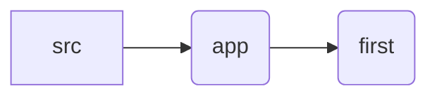

# first-assignment Home page clone

### Links

- **[First Assignment - Live Demo](https://first-assignment.pages.dev/)**

The Assignment folder directory:

**The Original Website for Reference: https://preview.colorlib.com/?authuser=0#hepta**

**Installation:**

1. Install Node.js and npm.

2. Clone the repository: `git clone https://github.com/hawaryo/Assignment.git`

3. Navigate to the project directory: `cd first-assignment`

4. Install dependencies: `npm install`

5. to run the page: `npm run dev`
