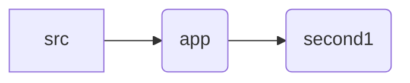

# Second-assignment Part 1 Home page clone

### Links

- **[Second Assignment Part-1 - Live Demo](https://239e08ad.first-assignment.pages.dev/second1)**

The Assignment folder directory:

**The Original Website for Reference: https://startbootstrap.com/previews/shop-item**

**Installation:**

1. Install Node.js and npm.
2. Clone the repository: `git clone https://github.com/hawaryo/Assignment.git`
3. Navigate to the project directory: `cd first-assignment`
4. Install dependencies: `npm install`
5. to run the page: `npm run dev`
