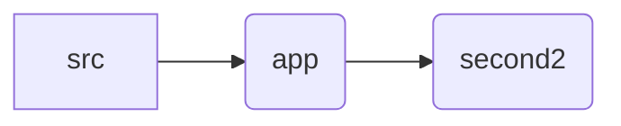

# Second-assignment Part 2 Home page clone

### Links

- **[Second Assignment Part-2 - Live Demo](https://first-assignment.pages.dev/second2)**

The Assignment folder directory:

**The Original Website for Reference: https://getbootstrap.com/docs/4.0/examples/blog/**

**Installation:**

1. Install Node.js and npm.
2. Clone the repository: `git clone https://github.com/hawaryo/Assignment.git`
3. Navigate to the project directory: `cd first-assignment`
4. Install dependencies: `npm install`
5. to run the page: `npm run dev`
